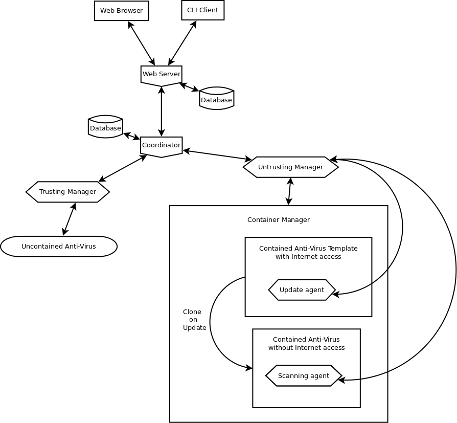

# docs

Documentation for Violetear

## Roles

### Web Browser and CLI Client

* Order creation of scanning tasks
* Order configuration changes
* View scan data

### Web Server

* Enforce authorization and permissions
* Passthrough configuration changes and scanning tasks to the **Coordinator**

### Coordinator

* Schedule scanning tasks to **Trusting Manager**(s) and **Untrusting Manager**(s)
* Passthrough configuration changes to **Trusting Manager**(s) and **Untrusting Manager**(s)

### Trusting Manager

* Manage **Uncontained Anti-Virus** updates
* Passthrough scanning tasks and collect scanning logs from **Uncontained Anti-Virus**

### Untrusting Manager

* Manage containers through **Container Manager**
* Passthrough scanning tasks and collect scanning logs from **Scanning agent**
* Manage Anti-Virus and system updates through **Update agent**

## Infrastructure

